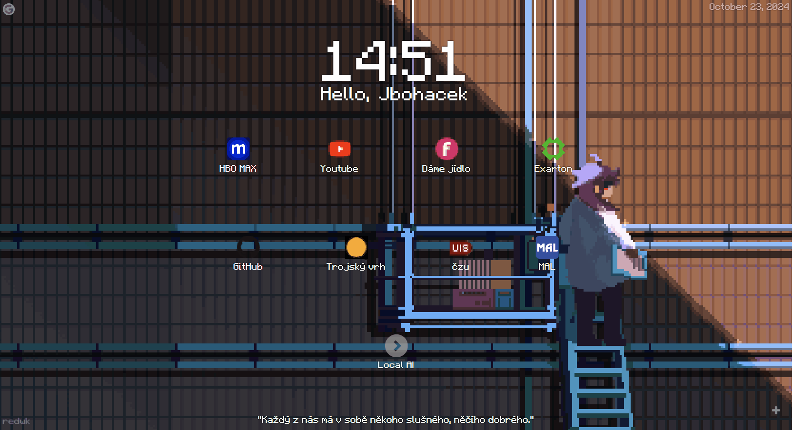

# PixelArtExtension
While browsing the Chrome Web Store, I stumbled upon the Pixel Tab extension, but noticed it lacked a settings tab. Determined to customize the experience, I decided to take the plunge and manually edit the extension's code.

## What's New?
- **Support for external links**: PixelArtExtension now fetches external links from a dedicated links.json file.
- **24h format**: Times are now displayed in the 24h format for improved clarity.
- **Font change**: The previous font didn't support Cyrillic symbols, so it has been replaced with a more comprehensive option.
- **Czech quotes**: For an extra touch of personality, I've swapped out the standard quotes for their Czech counterparts.

**Please note**: This is an unofficial modification of the original [Pixel Tab](https://chromewebstore.google.com/detail/pixel-tab/ahdgijdojdfmmaghgfgdhhammlicpede) extension by @dotalek (Twitter: https://twitter.com/dotalek ). I do not own the original extension.

**If you wish to remove this modified version, simply email me at me@jbohacek.cz or jbohacek@email.cz .**